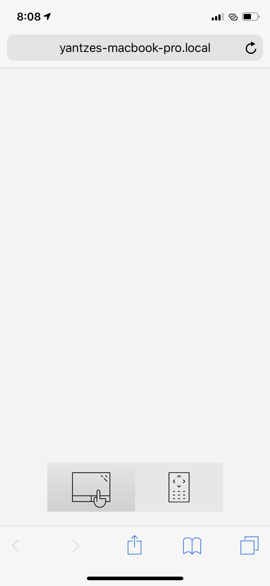
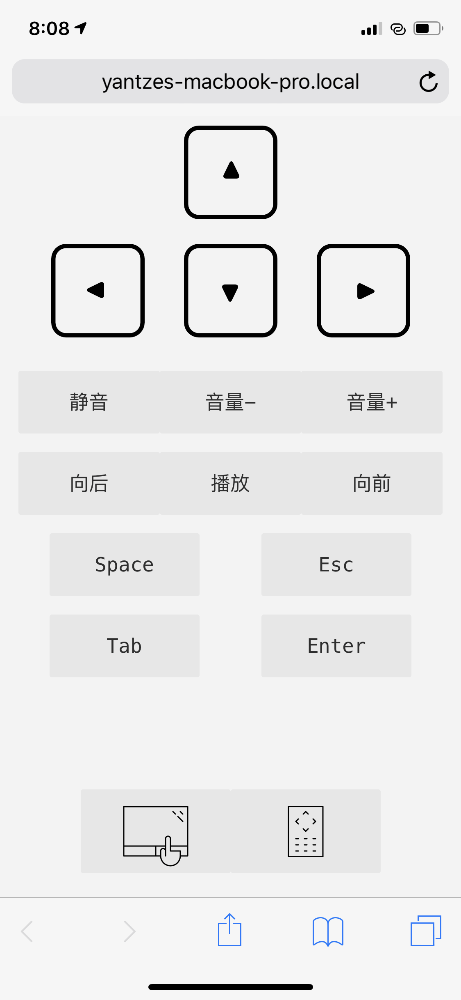

# Remote Control Server

Remote control your computer keyboard and trackpad.

## Install

```bash
git clone https://github.com/yantze/remote-control-server

cd remote-control-server

npm i

# Start server
npm run server
```

## Build
```
npm run start

# or output files to dist
npm run build-watch
```

Then access "http://you-computer-ip-address:3399" by your phone.

## Web Browser Screenshot

Trackpad panel can move your computer pointer, and all interaction like trackpad:


Control panel:


## Use Desktop UI App for a better experience

Go to https://github.com/yantze/remote-control
